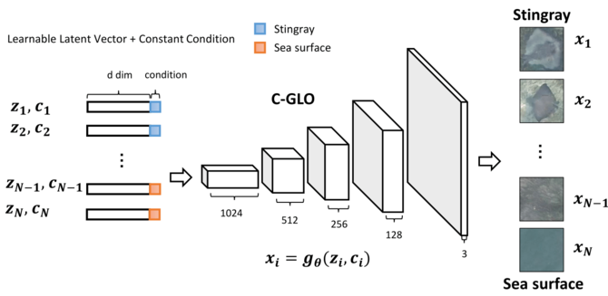
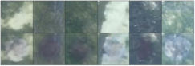
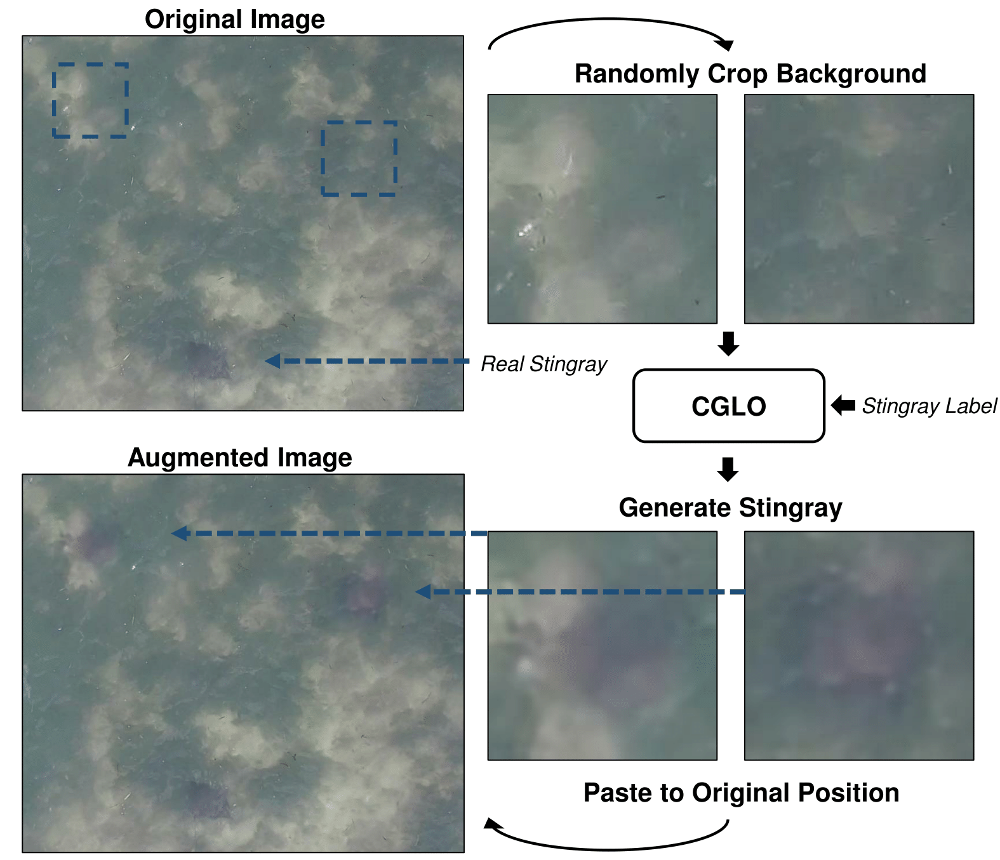

# Conditional-Generative-Latent-Optimization


## Requirements


## How to run
- Download Stingray Data:

```bash
$ python download.py
```

- run the training code:

```bash
# The training result will be saved in `./logs/FOLDER_NAME/`
$ python main.py --is_train=True
```

- run the testing code:

```bash
# The testing result will be saved in `./logs/FOLDER_NAME_test/`
$ python main.py --is_train=False --load_path=MODEL_DIR
```

## Result



